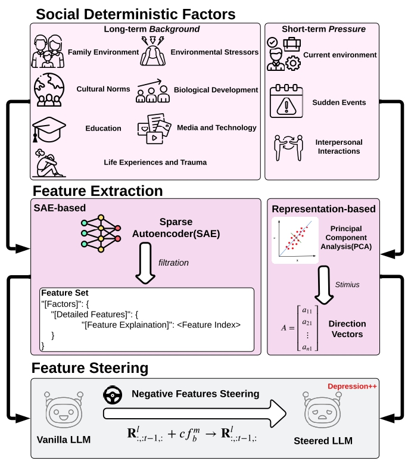

# WHAT MAKES YOUR MODEL A LOW-EMPATHY OR WARMTH PERSON: EXPLORING THE ORIGINS OF PERSONALITY IN LLMS

[](https://arxiv.org/abs/2410.10863)
[](https://huggingface.co/datasets/Chouoftears/LLM-Persona-Steering-Testset)

Here is an overview diagram about our pipeline to steer the LLM persona by dual ways.

<div align="center">
  
</div>


## **⏰ TODO List**

- [x] Release Dataset
- [x] Release SAE-based experiment code & instruction
- [ ] Release RepE-based experiment code & instruction

## 🧹 Preparation
Install required python packages:
```
pip install -r requirements.txt
```

## 👀 Stimius Processing

### SAE

1.1 Background Generation

Let't generate the keywords of each backgrounds first
```
cd src/stimius_processing
python SAE/processing_keywords.py --json_file [path to save bg json] --num[# of bgs you want]
```

Then, we can genertate bgs in two types(fixed & generative)

```
python SAE/processing_bg.py --json_file [path to bg json] --bg_type ['fixed' or 'gen']
```

1.2 Features Explorations
You can use convert_to_features to convert the background to a proper features list which includes the key features related the background description

```
python SAE/convert_to_features.py \
    --save_path [path to json need to save] \
    --pattern_path [path to pattern json] \
    --background [path to background json] \
    --layer [index of layer]
```

## 🧾 Vector Control & Running Testset

### SAE
run the Testset
```
cd src/steer_experiments
python SAE/sae_run.py \
    --model_name  \
    --sae_name  \
    --layer  \
    --coeff  \
    --temperature  \
    --freq_penalty  \
    --bg_type  \
    --steer_mode  \
    --steer_file_path  \
    --prompt_type  \
    --inference_type  \
    --save_dir_path
```

## 🙌 Evaluation

### SAE
You can get the result of the sae task. 
```
python SAE/analysis.py \
    --save_path \
    --prompt_type 1 
```

## Citation

Please consider citing our paper if you found our work interesting and useful.
```
@article{zhang2023safetybench,
      title={SafetyBench: Evaluating the Safety of Large Language Models with Multiple Choice Questions}, 
      author={Zhexin Zhang and Leqi Lei and Lindong Wu and Rui Sun and Yongkang Huang and Chong Long and Xiao Liu and Xuanyu Lei and Jie Tang and Minlie Huang},
      journal={arXiv preprint arXiv:2309.07045},
      year={2023}
}

@article{lee2024llms,
  title={Do llms have distinct and consistent personality? trait: Personality testset designed for llms with psychometrics},
  author={Lee, Seungbeen and Lim, Seungwon and Han, Seungju and Oh, Giyeong and Chae, Hyungjoo and Chung, Jiwan and Kim, Minju and Kwak, Beong-woo and Lee, Yeonsoo and Lee, Dongha and others},
  journal={arXiv preprint arXiv:2406.14703},
  year={2024}
}

@article{yang2024makes,
  title={What makes your model a low-empathy or warmth person: Exploring the Origins of Personality in LLMs},
  author={Yang, Shu and Zhu, Shenzhe and Bao, Ruoxuan and Liu, Liang and Cheng, Yu and Hu, Lijie and Li, Mengdi and Wang, Di},
  journal={arXiv preprint arXiv:2410.10863},
  year={2024}
}
```
